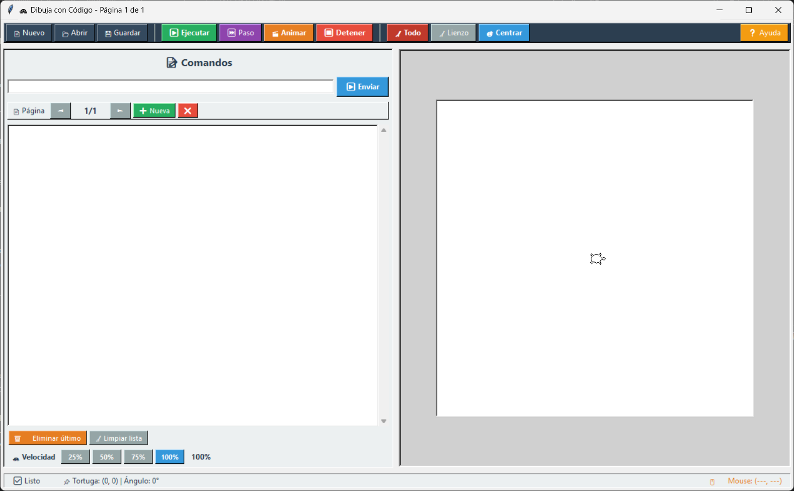

# 🐢 Turtle

[](https://github.com/gjrodriguezcl/turtle)
[](https://python.org)
[](LICENSE)

> **Turtle** es una herramienta educativa para niños que enseña programación visual usando Python y Turtle. Con comandos simples en español, los niños pueden dibujar, colorear y crear animaciones.

---

## 🚀 Características

- **Comandos en español**: Fáciles de entender (AD, DE, LCOLOR, RELLENAR, etc.)
- **Interfaz gráfica**: Diseño limpio y profesional con Tkinter
- **Páginas**: Múltiples lienzos para crear animaciones paso a paso
- **Animación**: Reproduce todas las páginas secuencialmente en bucle
- **Guardar/Cargar**: Proyectos guardados en archivos `.dib`
- **Cursores**: Más de 25 cursores diferentes (tortuga, avión, persona, etc.)
- **Relleno**: Colorea figuras cerradas con `INICIAR_RELLENO` y `TERMINAR_RELLENO`
- **Coordenadas en tiempo real**: Muestra la posición del mouse sobre el lienzo

---

## 📸 Capturas de pantalla



---

## 🛠️ Instalación y uso

### Opción 1: Descargar el ejecutable (recomendado)

1. Descarga `Turtle.exe` desde la sección [Releases](https://github.com/gjrodriguezcl/turtle/releases)
2. Ejecuta el archivo (no requiere instalación)

### Opción 2: Ejecutar desde el código fuente

```bash
# Clonar el repositorio
git clone https://github.com/gjrodriguezcl/turtle.git
cd turtle

# Instalar dependencias (si es necesario)
pip install -r requirements.txt

# Ejecutar
python main.py

# 🐢 Ejemplos de Turtle

## 🎯 ¿Cómo usar estos ejemplos?

1. Abre la aplicación "Dibuja con Código"
2. Haz clic en **"Abrir"**
3. Selecciona el archivo `.dib` que quieras cargar
4. Haz clic en **"Ejecutar"** para ver el dibujo
5. Usa **"Animar"** para ver todas las páginas en secuencia

---

## 📚 Lista de ejemplos

| Archivo | Descripción | Comandos destacados |
| :--- | :--- | :--- |
| `cuadrado_relleno.dib` | Cuadrado rojo relleno | `REPETIR`, `FCOLOR`, `INICIAR_RELLENO` |
| `circulo_relleno.dib` | Círculo amarillo relleno | `REPETIR`, `FCOLOR`, `INICIAR_RELLENO` |
| `triangulo_relleno.dib` | Triángulo azul relleno | `REPETIR`, `FCOLOR`, `INICIAR_RELLENO` |
| `estrella_relleno.dib` | Estrella verde relleno | `REPETIR`, `FCOLOR`, `INICIAR_RELLENO` |
| `casa_relleno.dib` | Casa con techo, puerta y ventana | `FCOLOR`, `INICIAR_RELLENO`, `TERMINAR_RELLENO` |
| `flor_relleno.dib` | Flor con pétalos rellenos | `REPETIR`, `FCOLOR`, `INICIAR_RELLENO` |
| `sol_relleno.dib` | Sol relleno con rayos | `REPETIR`, `FCOLOR`, `INICIAR_RELLENO` |
| `arcoiris_relleno.dib` | Arcoíris con 6 páginas | `PAGINA`, `FCOLOR`, `INICIAR_RELLENO` |
| `paisaje_relleno.dib` | Paisaje con cielo, sol y montañas | `FCOLOR`, `INICIAR_RELLENO` |
| `tren_relleno.dib` | Tren con 4 vagones | `PAGINA`, `FCOLOR`, `INICIAR_RELLENO` |

---

## 💡 Consejos para crear tus propios dibujos

1. **Usa `FCOLOR`** para elegir el color de relleno
2. **Usa `INICIAR_RELLENO`** antes de dibujar
3. **Dibuja una figura cerrada** (cuadrado, círculo, triángulo, etc.)
4. **Usa `TERMINAR_RELLENO`** para aplicar el color
5. **Usa `PAGINA`** para crear animaciones
6. **Usa `REPETIR`** para ahorrar líneas de código

---

## 🎨 Ejemplo rápido

```dib
# Dibujar un círculo amarillo
FCOLOR 255 255 0
INICIAR_RELLENO
REPETIR 36 AD 10 DE 10
TERMINAR_RELLENO